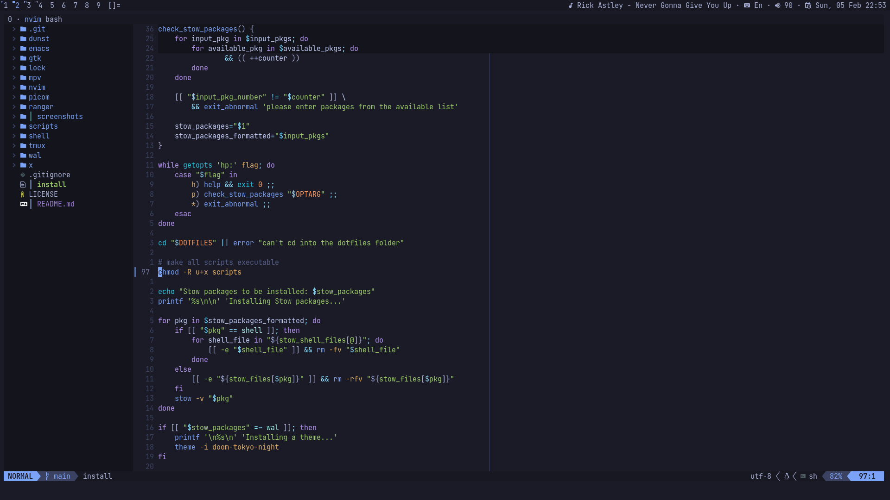
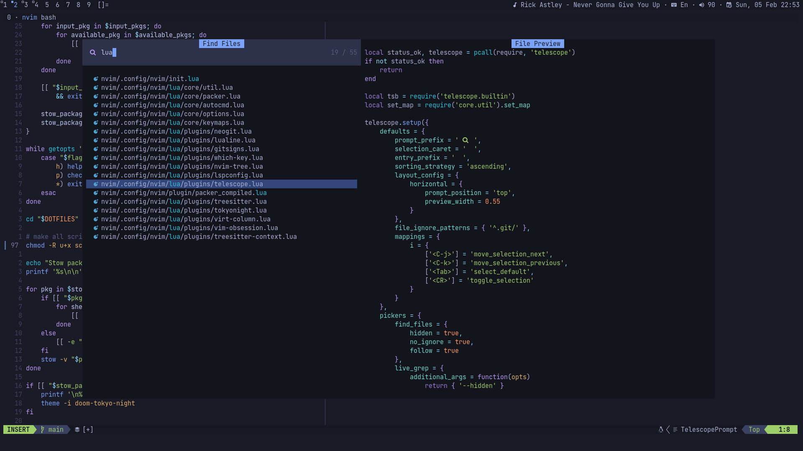
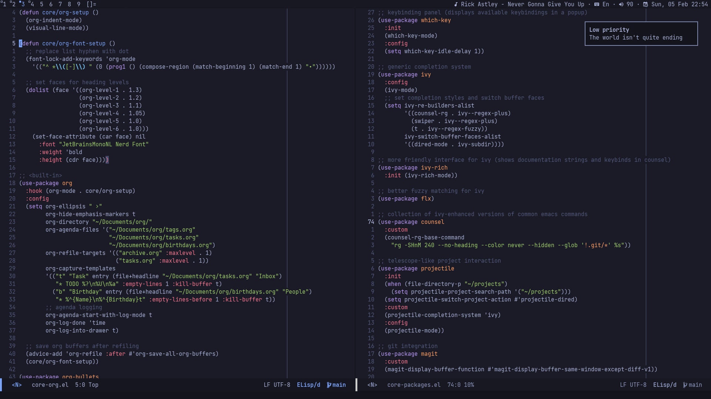

# dotfiles

My personal configuration files for a system without a desktop environment. Wayland is not supported.

## Showcase





## Installation

In order to install dotfiles you need GNU Stow and hsetroot. Warning: the script will replace your existing configuration files in the `HOME` directory.

```bash
git clone https://github.com/ryadovoyy/dotfiles.git ~/.dotfiles
cd ~/.dotfiles
chmod u+x install-dotfiles
```

Run the following to install all packages:

```bash
./install-dotfiles
```

You can also specify certain packages with the `-p` option (see `./install-dotfiles -h` for further information).
